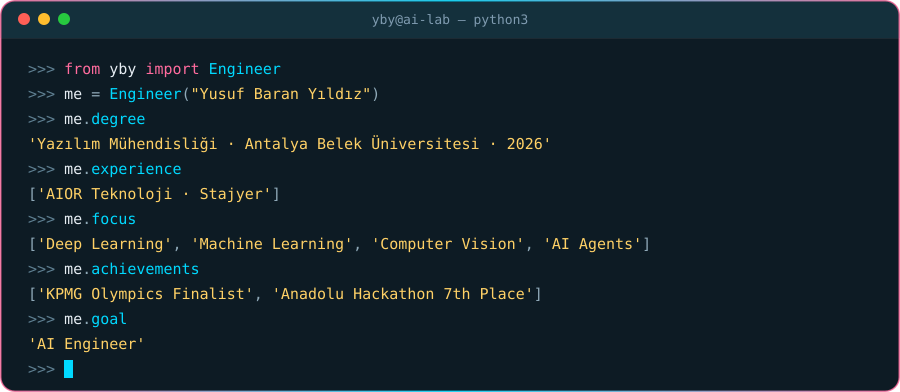
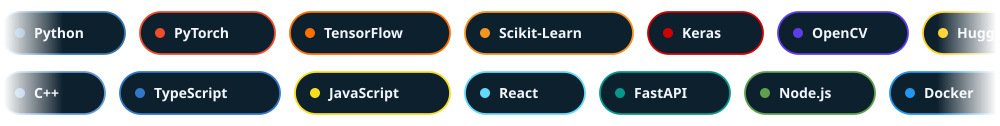
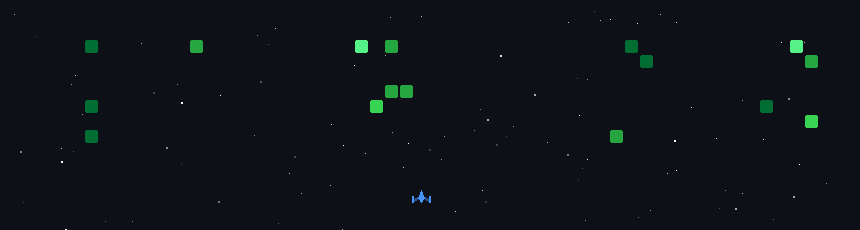
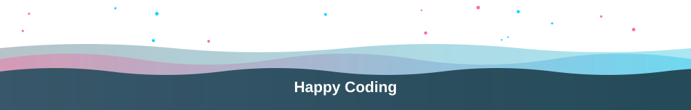

<!-- ============================================================== -->
<!-- YUSUF BARAN YILDIZ - DYNAMIC ANIMATED GITHUB PROFILE README -->
<!-- ============================================================== -->

<!-- ANIMATED HERO BANNER -->
<p align="center">
  
</p>

<!-- DYNAMIC TYPEWRITER TITLE -->
<p align="center">
  <a href="https://github.com/YusufBaranYildiz">
    
  </a>
</p>

<!-- HIGHLIGHT BADGES -->
<p align="center">
  <a href="https://github.com/YusufBaranYildiz">
    
  </a>
  <a href="#başarılar--yarışmalar">
    
  </a>
  <a href="#başarılar--yarışmalar">
    
  </a>
  <a href="#benimle-iletişime-geçin">
    
  </a>
</p>

<!-- NEON COMET DIVIDER -->
<p align="center">
  
</p>

<!-- ==================== ABOUT ME ==================== -->
<h2 align="center">Hakkımda</h2>

<p align="center">
  Antalya Belek Üniversitesi <b>Yazılım Mühendisliği</b> bölümünden tam burslu olarak mezun oldum.<br/>
  Yapay zekâ, makine öğrenmesi ve derin öğrenme alanlarında pratik proje deneyimiyle; <b>çok ajanlı (multi-agent) sistemler, LLM entegrasyonu ve agentic ERP mimarileri</b> üzerine odaklanıyorum.<br/>
  Analitik düşünce yapısıyla teorik modelleri uçtan uca çalışan, ölçeklenebilir ve güvenli kurumsal çözümlere dönüştürüyorum.
</p>

<p align="center">
  <b>Antalya Belek Üniversitesi</b> — Yazılım Mühendisliği (Lisans, Tam Burslu, 2023–2026)<br/>
  <b>Sakarya Uygulamalı Bilimler Üniversitesi</b> — Bilgisayar Destekli Tasarım ve Animasyon (Ön Lisans, 2021–2023)<br/>
  <b>AIOR Teknoloji</b> — Stajyer Yazılım Geliştirici (Agentic ERP SaaS & Endüstriyel AI Sistemleri, 2026)<br/>
  <b>KPMG IxT Olimpiyatları</b> Finalisti (40 Kişilik Türkiye Finali) &nbsp;·&nbsp; <b>Anadolu Hackathon</b> 7.'si (WeatherWise)<br/>
  <b>Odak Alanları:</b> Multi-Agent Systems · LLM Integration · Deep Learning · Computer Vision · Industrial AI<br/>
  <b>Hedef:</b> <i>AI Engineer / Machine Learning Specialist</i>
</p>

<!-- ANIMATED PYTHON REPL TERMINAL -->
<p align="center">
  
</p>

<!-- NEON COMET DIVIDER -->
<p align="center">
  
</p>

<!-- ==================== ACHIEVEMENTS ==================== -->
<h2 align="center">Başarılar &amp; Yarışmalar</h2>

<p align="center">
  
</p>

<!-- NEON COMET DIVIDER -->
<p align="center">
  
</p>

<!-- ==================== TECH STACK ==================== -->
<h2 align="center">Tech Stack &amp; Beceriler</h2>

<!-- DUAL-ROW INFINITE ROTATING CAROUSEL -->
<p align="center">
  
</p>

<!-- FLOATING TECH ICONS -->
<p align="center">
  
</p>

<!-- TECH BADGES GRID -->
<div align="center">

<table width="100%">
  <tr>
    <td align="center" width="25%"><b>Yapay Zekâ &amp; LLM</b></td>
    <td align="center" width="25%"><b>Programlama Dilleri</b></td>
    <td align="center" width="25%"><b>Web Geliştirme</b></td>
    <td align="center" width="25%"><b>Veritabanı &amp; Güvenlik</b></td>
  </tr>
  <tr>
    <td valign="top">
      <br/>
      <br/>
      <br/>
      <br/>
      <br/>
      <br/>
      
    </td>
    <td valign="top">
      <br/>
      <br/>
      <br/>
      <br/>
      
    </td>
    <td valign="top">
      <br/>
      <br/>
      <br/>
      <br/>
      
    </td>
    <td valign="top">
      <br/>
      <br/>
      <br/>
      <br/>
      
    </td>
  </tr>
</table>

</div>

<!-- NEON COMET DIVIDER -->
<p align="center">
  
</p>

<!-- ==================== FEATURED PROJECTS ==================== -->
<h2 align="center">Öne Çıkan Projeler</h2>

<div align="center">

<table width="100%">
  <tr>
    <td width="50%" valign="top">
      <h3 align="center">Orbital Shield</h3>
      <p align="center">
        
        
        
        
      </p>
      <p>NASA NeoWs API tabanlı, çok ajanlı (multi-agent) otonom uzay tehdidi izleme ve erken uyarı sistemi. Kaggle AI Agents Intensive Capstone projesi.</p>
      <ul>
        <li>Otonom veri toplama, risk analizi ve tehdit değerlendirme ajanları</li>
        <li>Retro-fütüristik HTML/CSS/JS canlı takip paneli (dashboard)</li>
        <li>Gerçek zamanlı yakın Dünya nesneleri (NEO) yörünge analizi</li>
      </ul>
      <p align="center">
        <a href="https://github.com/YusufBaranYildiz">
          
        </a>
      </p>
    </td>
    <td width="50%" valign="top">
      <h3 align="center">WeatherWise</h3>
      <p align="center">
        
        
        
        
      </p>
      <p>Sivas Üniversitesi Anadolu Hackathon'da kendi alanında 7. olan, yerel Llama3 modeli ve Telegram bot entegrasyonlu hava verisi karar destek sistemi.</p>
      <ul>
        <li>FastAPI arka ucu ve yerel LLM tabanlı karar destek motoru</li>
        <li>HTML5 Canvas parçacık (particle) efektleriyle animasyonlu arayüz</li>
        <li>Telegram botu üzerinden anlık sorgulama ve öneri akışı</li>
      </ul>
      <p align="center">
        <a href="https://github.com/YusufBaranYildiz">
          
        </a>
      </p>
    </td>
  </tr>
  <tr>
    <td width="50%" valign="top">
      <h3 align="center">BAP Süreç Yönetim Platformu</h3>
      <p align="center">
        
        
        
        
      </p>
      <p>Antalya Belek Üniversitesi için geliştirilen, çok şemalı (multi-schema) ve Row-Level Security (RLS) güvenlikli tam kapsamlı Bilimsel Araştırma Projeleri yönetim sistemi.</p>
      <ul>
        <li>ASP.NET Core/.NET 8, React ve Neon PostgreSQL mimarisi</li>
        <li>JWT tabanlı rol yetkilendirmesi (RBAC) ve dinamik onay akışları</li>
        <li>Mermaid ve UML sınıf/ER diyagramları ile sistem modellemesi</li>
      </ul>
      <p align="center">
        <a href="https://github.com/YusufBaranYildiz/antalya-belek-proje-surec-yonetimi-v0.5">
          
        </a>
      </p>
    </td>
    <td width="50%" valign="top">
      <h3 align="center">IBM Granite 4.0 Doküman Özetleme</h3>
      <p align="center">
        
        
        
        
      </p>
      <p>LangChain, Docling ve Replicate entegrasyonuyla Project Gutenberg büyük edebi metinleri üzerinde çalışan akıllı doküman özetleme sistemi.</p>
      <ul>
        <li>Docling ile yapılandırılmış doküman parsing ve chunking</li>
        <li>IBM Granite 4.0 LLM ile bağlamsal ve hiyerarşik özetleme</li>
        <li>Geniş metin hacimlerinde optimize edilmiş prompt mühendisliği</li>
      </ul>
      <p align="center">
        <a href="https://github.com/YusufBaranYildiz">
          
        </a>
      </p>
    </td>
  </tr>
  <tr>
    <td width="50%" valign="top">
      <h3 align="center">kamerakontrol.com</h3>
      <p align="center">
        
        
        
      </p>
      <p>AIOR Teknoloji bünyesinde geliştirilen; endüstriyel kalite kontrol, yangın algılama, plaka tanıma ve tekstil muayene sistemlerini sunan kurumsal AI platformu.</p>
      <ul>
        <li>Görüntü işleme tabanlı endüstriyel hata ve anomali tespiti</li>
        <li>Ürün özellikleri, teknik blog ve kurumsal vitrin mimarisi</li>
        <li>Canlıya alınmış ölçeklenebilir web altyapısı</li>
      </ul>
      <p align="center">
        <a href="https://github.com/YusufBaranYildiz">
          
        </a>
      </p>
    </td>
    <td width="50%" valign="top">
      <h3 align="center">KPMG IxT Olimpiyatları Vaka Çalışması</h3>
      <p align="center">
        
        
        
      </p>
      <p>Türkiye genelinde üç aşamalı zorlu elemeyi geçerek 40 kişilik finale yükselinen, KPMG yöneticilerine sunulan veri bilimi ve yatırım tavsiyesi projesi.</p>
      <ul>
        <li>Makroekonomik belirsizlik analizi ve zaman serisi modellemesi</li>
        <li>Yatırım fonu portföy optimizasyonu ve risk projeksiyonu</li>
        <li>Üst düzey karar alıcılara yönelik analitik vaka sunumu</li>
      </ul>
      <p align="center">
        <a href="https://github.com/YusufBaranYildiz">
          
        </a>
      </p>
    </td>
  </tr>
</table>

</div>

<!-- NEON COMET DIVIDER -->
<p align="center">
  
</p>

<!-- ==================== GAMIFIED ACTIVITY ==================== -->
<h2 align="center">Canlı GitHub Etkileşimi &amp; Oyun</h2>

<!-- SPACE SHOOTER GAME -->
<div align="center">
  <p><i>Günlük commit hareketlerimi simüle eden uzay arcade oyunu:</i></p>
  
</div>

<!-- NEON COMET DIVIDER -->
<p align="center">
  
</p>

<!-- ==================== GITHUB STATS ==================== -->
<h2 align="center">Canlı GitHub İstatistikleri</h2>

<p align="center">
  <!-- STREAK STATS -->
  <a href="https://github.com/YusufBaranYildiz">
    
  </a>
</p>

<p align="center">
  <!-- STATS CARD -->
  <a href="https://github.com/YusufBaranYildiz">
    
  </a>
  <!-- TOP LANGUAGES -->
  <a href="https://github.com/YusufBaranYildiz">
    
  </a>
</p>

<!-- NEON COMET DIVIDER -->
<p align="center">
  
</p>

<!-- ==================== EDUCATION & CERTIFICATES ==================== -->
<h2 align="center">Eğitim &amp; Sertifikalar</h2>

<div align="center">

### Akademik Geçmiş

| Kurum | Program | Derece / Durum |
|:---|:---|:---:|
| **Antalya Belek Üniversitesi** | Yazılım Mühendisliği (Lisans) | **Mezun (2026) · Tam Burslu** |
| **Sakarya Uygulamalı Bilimler Üniversitesi** | Bilgisayar Destekli Tasarım ve Animasyon (Ön Lisans) | **Tamamlandı (2021–2023)** |

<br/>

### Profesyonel Sertifikalar &amp; Bootcamp Programları

<details open>
<summary><b>Tamamlanan Resmi Sertifikalar (Genişlet / Daralt)</b></summary>
<br/>

| Kurum | Sertifika / Eğitim Programı | Yıl |
|:---|:---|:---:|
| **CISCO & IBM SkillsBuild** | AI Fundamentals with IBM SkillsBuild | 2025 |
| **CISCO Networking Academy** | Data Science Essentials with Python | 2026 |
| **IBM & Kodluyoruz** | AI4Future — İleri Seviye | 2026 |
| **IBM** | Craft Precise Prompts for AI Models | 2026 |
| **İstanbul Büyükşehir TECH İstanbul** | Makine Öğrenmesi Bootcamp Atölyesi | 2026 |
| **İstanbul Büyükşehir TECH İstanbul** | Deep Learning Atölyesi | 2025 |
| **Garanti BBVA Yeni Nesil Kariyer Okulu** | Temel Makine Öğrenmesi | 2025 |
| **Garanti BBVA Yeni Nesil Kariyer Okulu** | Teknoloji Serisi: Gen AI | 2025 |
| **Garanti BBVA GENÇ** | Kariyerime İlk Adım Programı | 2025 |
| **SOCAR Türkiye** | Next Gen Academy | 2026 |
| **Coderspace** | Veri Bilimi ve Yapay Zeka Yaz Okulu | 2025 |
| **Veri Analizi Okulu** | Yapay Zekâ ve Makine Öğrenmesi Başarı Belgesi | 2026 |
| **Veri Analizi Okulu** | Yapay Zekâ ve Kolaylaştırıcı Araçlar Başarı Belgesi | 2026 |

</details>

</div>

<!-- NEON COMET DIVIDER -->
<p align="center">
  
</p>

<!-- ==================== CURRENT GOALS ==================== -->
<h2 align="center">Mevcut Hedefler &amp; Roadmap</h2>

<div align="center">

```yaml
Current Roadmap:
  [x] Yazılım Mühendisliği lisansını başarıyla tamamlama (Tam Burslu, 2026)
  [x] Agentic B2B SaaS ve ERP staj deneyimi (AIOR Teknoloji)
  [x] Ulusal hackathon ve veri bilimi finalleri (KPMG Finalist, Anadolu Hackathon 7.)
  [-] Çok ajanlı (Multi-Agent) otonom AI sistemleri geliştirme ve optimizasyon
  [-] LLM orkestrasyonu (LangChain, Llama3, Docling) ve kurumsal entegrasyonlar
  [-] Açık kaynak kodlu (Open-Source) yapay zekâ ekosistemine düzenli katkı
  [>] AI / Machine Learning Engineer olarak yenilikçi kurumsal projelere değer katma
```

</div>

<!-- NEON COMET DIVIDER -->
<p align="center">
  
</p>

<!-- ==================== CONTACT ==================== -->
<h2 align="center">Benimle İletişime Geçin</h2>

<p align="center">
  <a href="mailto:yusufbarany1@gmail.com">
    
  </a>
  <a href="https://www.linkedin.com/in/yusuf-baran-yildiz-136187300/" target="_blank">
    
  </a>
  <a href="https://github.com/YusufBaranYildiz" target="_blank">
    
  </a>
</p>

<!-- NEON COMET DIVIDER -->
<p align="center">
  
</p>

<!-- PROFILE VIEWS & FOOTER -->
<p align="center">
  
</p>

<p align="center">
  
</p>

<p align="center">
  <strong>Projelerim ilginizi çektiyse bir Star bırakabilirsiniz!</strong><br/>
  <em>Designed &amp; Engineered by <b>Yusuf Baran YILDIZ</b></em>
</p>
