<!-- ============================================================== -->
<!-- 🚀 YUSUF BARAN YILDIZ - DYNAMIC ANIMATED GITHUB PROFILE README -->
<!-- ============================================================== -->

<!-- 🌌 ANIMATED HERO BANNER -->
<p align="center">
  
</p>

<!-- ⚡ DYNAMIC TYPEWRITER TITLE -->
<p align="center">
  <a href="https://github.com/YusufBaranYildiz">
    
  </a>
</p>

<!-- 🏷️ HIGHLIGHT BADGES -->
<p align="center">
  <a href="https://github.com/YusufBaranYildiz">
    
  </a>
  <a href="#-başarılar--yarışmalar">
    
  </a>
  <a href="#-başarılar--yarışmalar">
    
  </a>
  <a href="#-benimle-iletişime-geçin">
    
  </a>
</p>

<!-- 💫 NEON COMET DIVIDER -->
<p align="center">
  
</p>

<!-- ==================== 👨‍💻 ABOUT ME ==================== -->
<h2 align="center">👨‍💻 Hakkımda</h2>

<p align="center">
  👋 Merhaba! 2026 yılında <b>Antalya Belek Üniversitesi Yazılım Mühendisliği</b> bölümünden tam burslu olarak mezun oldum.<br/>
  Tutkuyla <b>Yapay Zekâ, Derin Öğrenme (Deep Learning) ve Makine Öğrenmesi</b> ekosistemine odaklanıyorum.<br/>
  Büyük ölçekli veri analitiği, bilgisayarlı görü (Computer Vision), otonom AI ajanları ve gerçek dünya problemlerini çözen akıllı sistemler geliştiriyorum.
</p>

<p align="center">
  🎓 <b>Antalya Belek Üniversitesi</b> — Yazılım Mühendisliği (Tam Burslu, 2026 Mezunu)<br/>
  💼 <b>AIOR Teknoloji</b> — Stajyer (AI / ML & Yazılım Geliştirme)<br/>
  🏆 <b>KPMG Olympics</b> Finalisti &nbsp;·&nbsp; 🚀 <b>Anadolu Hackathon</b> 7.'si<br/>
  🤖 <b>Odak Alanları:</b> Deep Learning · Computer Vision · Predictive Analytics · Autonomous AI Agents<br/>
  🎯 <b>Kariyer Hedefi:</b> <i>AI Engineer / Machine Learning Specialist</i>
</p>

<!-- 💻 ANIMATED PYTHON REPL TERMINAL -->
<p align="center">
  
</p>

<!-- 💫 NEON COMET DIVIDER -->
<p align="center">
  
</p>

<!-- ==================== 🏆 ACHIEVEMENTS ==================== -->
<h2 align="center">🏆 Başarılar &amp; Yarışmalar</h2>

<p align="center">
  
</p>

<!-- 💫 NEON COMET DIVIDER -->
<p align="center">
  
</p>

<!-- ==================== 🛠️ TECH STACK ==================== -->
<h2 align="center">🛠️ Tech Stack &amp; Teknolojiler</h2>

<!-- 🔄 DUAL-ROW INFINITE ROTATING CAROUSEL -->
<p align="center">
  
</p>

<!-- 🎨 FLOATING TECH ICONS -->
<p align="center">
  
</p>

<!-- TECH BADGES GRID -->
<div align="center">

<table>
  <tr>
    <td align="center" width="33%"><b>🤖 AI &amp; Machine Learning</b></td>
    <td align="center" width="33%"><b>🔥 Programlama Dilleri</b></td>
    <td align="center" width="33%"><b>🌐 Web, Cloud &amp; Araçlar</b></td>
  </tr>
  <tr>
    <td>
      
      <br/>
      
      <br/>
      
      <br/>
      
      
    </td>
    <td>
      <br/>
      <br/>
      <br/>
      
    </td>
    <td>
      <br/>
      <br/>
      <br/>
      
    </td>
  </tr>
</table>

</div>

<!-- 💫 NEON COMET DIVIDER -->
<p align="center">
  
</p>

<!-- ==================== ⚡ SYSTEM METRICS ==================== -->
<h2 align="center">⚡ Yetkinlik &amp; Model Metrikleri</h2>

<!-- 📊 ANIMATED SKILL PROGRESS BARS -->
<p align="center">
  
</p>

<!-- 💫 NEON COMET DIVIDER -->
<p align="center">
  
</p>

<!-- ==================== ⭐ FEATURED PROJECTS ==================== -->
<h2 align="center">⭐ Öne Çıkan Projeler</h2>

<div align="center">

<table width="100%">
  <tr>
    <td width="50%" valign="top">
      <h3 align="center">🤖 AI Otomasyon Risk Tahmin Sistemi</h3>
      <p align="center">
        
        
        
      </p>
      <p>Gerçek dünya iş gücü verilerini işleyerek sektör bazlı otomasyon riskini tahmin eden gelişmiş makine öğrenmesi modeli.</p>
      <ul>
        <li>✨ Gelişmiş veri ön işleme (Data Preprocessing) & feature engineering</li>
        <li>✨ Karşılaştırmalı model eğitimi & doğruluk analizleri</li>
        <li>✨ Kapsamlı risk projeksiyon çıktısı</li>
      </ul>
      <p align="center">
        <a href="https://github.com/YusufBaranYildiz/ai-automation-risk-prediction">
          
        </a>
      </p>
    </td>
    <td width="50%" valign="top">
      <h3 align="center">🎨 Deep Learning Stylist</h3>
      <p align="center">
        
        
        
      </p>
      <p>Derin konvolüsyonel ağlar (CNN) ile çalışan, sanatsal görüntü analiz ve stil transferi (Neural Style Transfer) sistemi.</p>
      <ul>
        <li>✨ Çok katmanlı özellik çıkarımı (Feature Extraction)</li>
        <li>✨ Gram Matrix optimizasyonu ve latent uzay işlemleri</li>
        <li>✨ Yüksek çözünürlüklü sanatsal stil sentezi</li>
      </ul>
      <p align="center">
        <a href="https://github.com/YusufBaranYildiz/DeepLearningStylist">
          
        </a>
      </p>
    </td>
  </tr>
  <tr>
    <td width="50%" valign="top">
      <h3 align="center">📊 AI Rep 2030</h3>
      <p align="center">
        
        
        
      </p>
      <p>Yapay zekânın 2030 vizyonu ve sektörler üzerindeki dönüştürücü etkisini analiz eden derinlemesine veri bilimi araştırması.</p>
      <ul>
        <li>✨ İstatistiksel hipotez testleri ve zaman serisi trendleri</li>
        <li>✨ İnteraktif veri görselleştirme panoları</li>
        <li>✨ Geleceğe dönük analitik öngörüler</li>
      </ul>
      <p align="center">
        <a href="https://github.com/YusufBaranYildiz/ai_rep2030">
          
        </a>
      </p>
    </td>
    <td width="50%" valign="top">
      <h3 align="center">🌐 BAP Proje Yönetim Platformu</h3>
      <p align="center">
        
        
        
      </p>
      <p>Antalya Belek Üniversitesi için geliştirilen tam kapsamlı Bilimsel Araştırma Projeleri (BAP) süreç takip ve yönetim sistemi.</p>
      <ul>
        <li>✨ Rol tabanlı yetkilendirme & dinamik başvuru onay akışları</li>
        <li>✨ Modern responsive UI & ölçeklenebilir mimari</li>
        <li>✨ Canlı proje durum ve bütçe raporlaması</li>
      </ul>
      <p align="center">
        <a href="https://github.com/YusufBaranYildiz/antalya-belek-proje-surec-yonetimi-v0.5">
          
        </a>
      </p>
    </td>
  </tr>
</table>

</div>

<!-- 💫 NEON COMET DIVIDER -->
<p align="center">
  
</p>

<!-- ==================== 🎮 GAMIFIED ACTIVITY ==================== -->
<h2 align="center">🎮 Canlı GitHub Etkileşimi &amp; Oyun</h2>

<!-- SPACE SHOOTER GAME -->
<div align="center">
  <p><i>👾 Günlük commit hareketlerimi simüle eden uzay arcade oyunu:</i></p>
  
</div>

<br/>

<!-- GITHUB CONTRIBUTION SNAKE -->
<div align="center">
  <p><i>🐍 Commit karelerini avlayan Contribution Snake animasyonu:</i></p>
  <picture>
    <source media="(prefers-color-scheme: dark)" srcset="https://raw.githubusercontent.com/YusufBaranYildiz/YusufBaranYildiz/output/github-snake-dark.svg">
    <source media="(prefers-color-scheme: light)" srcset="https://raw.githubusercontent.com/YusufBaranYildiz/YusufBaranYildiz/output/github-snake.svg">
    
  </picture>
</div>

<!-- 💫 NEON COMET DIVIDER -->
<p align="center">
  
</p>

<!-- ==================== 📊 GITHUB STATS ==================== -->
<h2 align="center">📊 Canlı GitHub İstatistikleri</h2>

<p align="center">
  <!-- TROPHY CASE -->
  
</p>

<p align="center">
  <!-- STREAK STATS -->
  <a href="https://github.com/YusufBaranYildiz">
    
  </a>
</p>

<p align="center">
  <!-- STATS CARD -->
  <a href="https://github.com/YusufBaranYildiz">
    
  </a>
  <!-- TOP LANGUAGES -->
  <a href="https://github.com/YusufBaranYildiz">
    
  </a>
</p>

<p align="center">
  <!-- ACTIVITY GRAPH -->
  <a href="https://github.com/YusufBaranYildiz">
    
  </a>
</p>

<!-- 💫 NEON COMET DIVIDER -->
<p align="center">
  
</p>

<!-- ==================== 📚 EDUCATION & CERTIFICATES ==================== -->
<h2 align="center">📚 Eğitim &amp; Sertifikalar</h2>

<div align="center">

### 🎓 Akademik Geçmiş

| Üniversite | Bölüm | Derece / Durum |
|:---|:---|:---:|
| **Antalya Belek Üniversitesi** | Yazılım Mühendisliği (Lisans) | 🎓 **Mezun (2026) · Tam Burslu** |
| **Sakarya Uygulamalı Bilimler Üniversitesi** | Bilgisayar Destekli Tasarım (Ön Lisans) | ✅ **Tamamlandı** |

<br/>

### 🏅 Profesyonel Sertifikalar &amp; Bootcamp Programları

<details open>
<summary><b>⭐ Tamamlanan Resmi Sertifikalar (Genişlet / Daralt)</b></summary>
<br/>

| Kurum | Sertifika / Eğitim Programı | Yıl |
|:---|:---|:---:|
| 🌐 **CISCO & IBM SkillsBuild** | AI Fundamentals with IBM SkillsBuild | 2025 |
| 📊 **CISCO Networking Academy** | Data Science Essentials With Python | 2026 |
| 🧠 **İstanbul Büyükşehir Belediyesi** | Deep Learning Atölyesi | 2025 |
| 🏦 **GARANTİ BBVA** | Makine Öğrenmesi Programı | 2025 |
| ⚡ **GARANTİ BBVA** | Generative AI Teknoloji Serisi | 2025 |
| 🚀 **İstanbul Büyükşehir Belediyesi** | Makine Öğrenmesi Bootcamp | 2026 |
| 🏛️ **BTK AKADEMİ** | Python Programlama for AI | 2024 |
| 🧩 **BTK AKADEMİ** | AI ve Algoritmalarına Giriş | 2025 |

</details>

</div>

<!-- 💫 NEON COMET DIVIDER -->
<p align="center">
  
</p>

<!-- ==================== 🎯 CURRENT GOALS ==================== -->
<h2 align="center">🎯 Mevcut Hedefler &amp; Roadmap</h2>

<div align="center">

```yaml
Current Roadmap:
  [✔] Yazılım Mühendisliği lisansını başarıyla tamamlama (2026)
  [✔] Yapay Zekâ & Yazılım staj deneyimi kazanma (AIOR Teknoloji)
  [✔] Hackathon & Yarışmalarda derece elde etme (KPMG Finalist, Anadolu Hackathon 7.)
  [⚡] Derin Öğrenme & Vision modellerini optimize etme
  [⚡] Çok ajanlı (Multi-Agent) AI sistemleri ve otomasyon mimarileri
  [⚡] Açık kaynak kodlu (Open-Source) ML ekosistemine düzenli katkı
  [🎯] AI / Machine Learning Engineer olarak global veya öncü projelere katılma
```

</div>

<!-- 💫 NEON COMET DIVIDER -->
<p align="center">
  
</p>

<!-- ==================== 💬 CONTACT ==================== -->
<h2 align="center">💬 Benimle İletişime Geçin</h2>

<p align="center">
  <a href="mailto:yusufbarany1@gmail.com">
    
  </a>
  <a href="https://www.linkedin.com/in/yusuf-baran-yildiz-136187300/" target="_blank">
    
  </a>
  <a href="https://github.com/YusufBaranYildiz" target="_blank">
    
  </a>
</p>

<!-- 💫 NEON COMET DIVIDER -->
<p align="center">
  
</p>

<!-- 📊 PROFILE VIEWS & FOOTER -->
<p align="center">
  
</p>

<p align="center">
  
</p>

<p align="center">
  <strong>⭐ Projelerim ilginizi çektiyse bir Star bırakmayı unutmayın!</strong><br/>
  <em>Designed &amp; Engineered with ❤️ by <b>Yusuf Baran YILDIZ</b></em>
</p>
